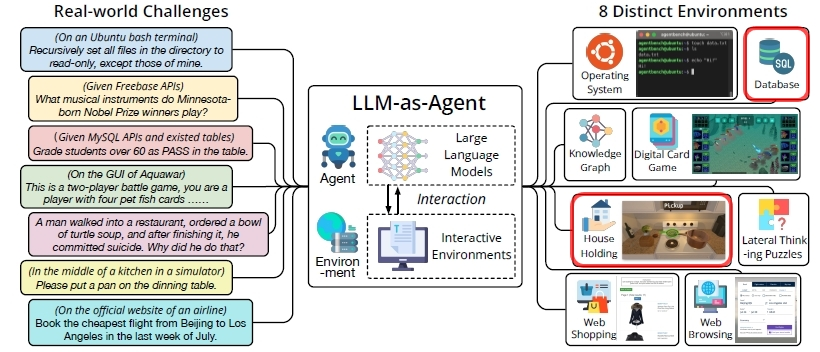

# 🚀【松尾研LLM講座2025応用】メイン/アドバンスコンペ 解法まとめ

〜ローカルLLMによるAIエージェント開発コンペ〜 
LLMが言語処理能力を活用しインタラクティブに環境を改善する指示を正確に
出力できるかを競うコンペ。AI Agentsの基礎となる技術を関わるコンペである。 
目次 
1. コンペ概要
2. 私の順位・スコア
3. メインコンペ取組み 
3.1. 取組み概要 
3.2. データセット 
3.3. 作成プログラム 
3.4. スコア改善 
3.5. 所感 
4. アドバンスコンペ取組み 
4.1. 取組み概要 
4.2. データセット 
4.3. 作成プログラム 
4.4. スコア改善 
4.5. 所感 
5. 全体を通して 

## 1. コンペ概要
松尾研大規模言語モデル講座応用編の最終課題のコンペであり、メインと
アドバンスコンペの2トラックから構成される。 
- メインコンペ
Struct Evalというベンチマークを用いて、LLMが正確な構造化された
出力を生成できるかを競うコンペ。例えば、「これをjson形式で出力」とか
「json形式をyaml形式に変換」という指示に対応。 
- アドバンスコンペ
AgentBenchというベンチマーク(8つの多様なインタラクティブタスク)のうち
DB BenchとALFWorldの2タスクを用いて、LLMが与えられた指示に対して行動し、
環境とインタラクションすることで行動を改善し、最終的に期待される応えを
得ることができるかというエージェント能力を測るコンペ。
DB Benchはテーブル情報と要求を受け取り適切なクエリを組立ててDBを操作するタスク。
ALFWorldは環境描写+タスク目標を受取り目標を達成する行動を出力するタスク。 

**評価指標**：
評価指標は事務局から明確に開示されない(以下は推測)。 
- メインコンペ：F1スコア
- アドバンスコンペ：DB BenchとALFWorldの正解率から10点満点換算。

## 2. 私の順位・スコア
- **メインコンペ・スコア**：0.8093
- **メインコンペ予選通過順位**：17位 / 1000人程度
- **アドバンスコンペ・スコア**：4.4867
- **アドバンスコンペ最終順位**：48位 / 180人

Public から Private へスコアが上がっており、
過学習を抑えた特徴量設計＋CV設計が効いたと考えています。 

## 3. メインコンペ取組み
### 3.1 取組み概要
全体の流れは以下です。 
- 欠損値補完（単純補完は使わない）
- 財務指標の比率・派生特徴量生成
- テキスト情報の数値化（TF-IDF + SVD）
- カテゴリ特徴量のエンコード
- 複数モデルの OOFスタッキングアンサンブル
- PRカーブからF1最適閾値を決定

### 3.2 データセット
事務局が指定したデータセットは以下の通り。これらデータセットは
Hugging Faceからロード可能。 
<11_SFT向けデータセット> 
u-10bei/structured_data_with_cot_dataset 
u-10bei/structured_data_with_cot_dataset_v2 
u-10bei/structured_data_with_cot_dataset_512 
u-10bei/structured_data_with_cot_dataset_512_v2 
u-10bei/structured_data_with_cot_dataset_512_v4 
u-10bei/structured_data_with_cot_dataset_512_v5 
daichira/structured-3k-mix-sft 
daichira/structured-5k-mix-sft 
<21_DPO向けデータセット> 
u-10bei/dpo-dataset-qwen-cot 

👉 財務的な整合性を保った補完ができるのが利点です。 

### 3.3 作成プログラム
<11_データセットダウンロード> 
Dllm10.py：SFTデータセットのダウンロード 
Dllm11.py：DPOデータセットのダウンロード 
<21_データセット改善> 
Dllm21.py：u-10bei/structured_data_with_cot_dataset_512_v5のデータ解析し、"Text to TOML"を3倍、"Text to TOML"を1/3 
Dllm22.py：u-10bei/structured_data_with_cot_dataset_512_v2,v4のデータを、u-10bei/structured_data_with_cot_dataset_512_v5へ追加 
Dllm24.py：3データセット版 

👉「規模の違う会社を横並びで比較できる」という点で、DX投資判断と相性が良いと考えました。 

### 3.4 スコア改善

👉「DX」「デジタル」「改革」などの言葉の温度感をモデルに渡せるのが強みです。 

### 3.5 メインコンペ所感
単一モデルではなく、 
異なる性質のモデルを組み合わせるスタッキングアンサンブルを採用しました。 
1層目に以下のベースモデルを採用し、2層目にロジステック回帰を用いて最終結果を得ました。 
- XGBoost
- LightGBM
- CatBoost
- RandomForest
- SVM（RBF）

## 4. アドバンスコンペ取組み
### 4.1 取組み概要
全体の流れは以下です。 
- 欠損値補完（単純補完は使わない）
- 財務指標の比率・派生特徴量生成
- テキスト情報の数値化（TF-IDF + SVD）
- カテゴリ特徴量のエンコード
- 複数モデルの OOFスタッキングアンサンブル
- PRカーブからF1最適閾値を決定

ポイントは 
👉 「特徴量を厚く作り、モデルは平均化する」 です。 

### 4.2 データセット
事務局が指定したデータセットは以下の通り。 

👉 財務的な整合性を保った補完ができるのが利点です。 

### 4.3 作成プログラム
<11_データセットダウンロード> 
Dllm10.py：SFTデータセットのダウンロード 
Dllm11.py：DPOデータセットのダウンロード 
<21_データセット改善> 
Dllm21.py：u-10bei/structured_data_with_cot_dataset_512_v5のデータ解析し、"Text to TOML"を3倍、"Text to TOML"を1/3 
Dllm22.py：u-10bei/structured_data_with_cot_dataset_512_v2,v4のデータを、u-10bei/structured_data_with_cot_dataset_512_v5へ追加 
Dllm24.py：3データセット版 

👉「規模の違う会社を横並びで比較できる」という点で、DX投資判断と相性が良いと考えました。 

### 4.4 スコア改善

👉「DX」「デジタル」「改革」などの言葉の温度感をモデルに渡せるのが強みです。 

### 4.5 アドバンスコンペ所感
単一モデルではなく、 
異なる性質のモデルを組み合わせるスタッキングアンサンブルを採用しました。 
1層目に以下のベースモデルを採用し、2層目にロジステック回帰を用いて最終結果を得ました。 
- XGBoost
- LightGBM
- CatBoost
- RandomForest
- SVM（RBF）

👉ツリー系・距離系・線形系を混ぜることでPrivateスコアの安定性が向上しました。 

### 5. 全体を通して

## 動作環境(Execution Environment)
- Windows / Python(Anaconda等)など

## 基本的な使い方(Basic Usage)

## 出力ファイルと保存先(Output Files and Storage)

## フォルダ構成(Folder Structure)

## ファイルサイズ(File Size)

## 関連リンク(Related Links)
AGENTBENCH: EVALUATING LLMS AS AGENTS 
https://arxiv.org/abs/2308.03688 

## 注意事項(Notes)
None

